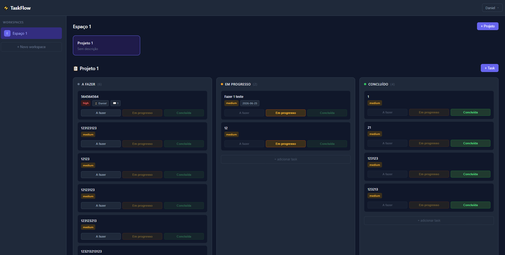

# TaskFlow API

> API REST de gestão de tarefas para times, com sistema de webhooks assíncronos orientado a eventos. Workspaces colaborativos onde membros criam projetos, atribuem tarefas e recebem notificações automáticas via webhooks quando tarefas são criadas, concluídas ou comentadas.


---

<!-- Substitua pela imagem ou GIF do kanban funcionando -->
<!-- Sugestão: capture uma tela mostrando o kanban com tasks nas 3 colunas -->
<!-- e salve como docs/kanban.png, depois descomente a linha abaixo -->
<!--  -->

---

## Stack

| Tecnologia | Versão |
|---|---|
| PHP | 8.4 |
| Laravel | 11 |
| MySQL | 8.4 |
| Redis | 7 |
| Laravel Sanctum | — |
| Docker / Docker Compose | — |

---

## Destaques técnicos

- **Sistema de webhooks orientado a eventos via Redis Queue** — eventos como `task.created` e `task.completed` disparam jobs assíncronos que fazem POST HTTP nas URLs cadastradas e registram o log de cada entrega em `webhook_deliveries`
- **41 testes automatizados com Pest** — cobertura de todos os endpoints com banco SQLite in-memory, factories para todas as entidades e testes de autorização por policy
- **CI/CD com GitHub Actions** — pipeline roda migrations e todos os testes a cada push no branch `master`
- **Autorização por Policies** — cada entidade tem regras isoladas (somente dono gerencia webhooks e membros, membros criam/editam tarefas)
- **Documentação interativa com Swagger** — todos os endpoints documentados com PHP 8 Attributes via L5-Swagger

---

## Funcionalidades

- Autenticação via token (register, login, logout, alterar senha, excluir conta)
- Workspaces com sistema de membros e roles (owner / member)
- Projetos aninhados em workspaces
- Tarefas com status (todo / in_progress / done), prioridade, prazo e responsável
- Comentários por tarefa
- Webhooks configuráveis por workspace com histórico de disparos
- Dashboard web com kanban interativo

---

## Documentação da API

Acesse a documentação interativa Swagger após subir o projeto:

```
http://localhost:8080/api/documentation
```

---

## Setup local com Docker

### Pré-requisitos
- Docker e Docker Compose instalados

### Passo a passo

**1. Clone o repositório**
```bash
git clone https://github.com/danwson/taskflow-api.git
cd taskflow-api
```

**2. Configure o ambiente**
```bash
cp .env.example .env
```

**3. Suba os containers**
```bash
docker compose up -d
```

**4. Instale as dependências**
```bash
docker compose exec php composer install
```

**5. Gere a chave da aplicação**
```bash
docker compose exec php php artisan key:generate
```

**6. Rode as migrations**
```bash
docker compose exec php php artisan migrate
```

**7. Acesse o sistema**

| Recurso | URL |
|---|---|
| Dashboard | http://localhost:8080 |
| API | http://localhost:8080/api |
| Documentação Swagger | http://localhost:8080/api/documentation |

---

## Setup local sem Docker (Laravel Herd / Valet)

```bash
git clone https://github.com/danwson/taskflow-api.git
cd taskflow-api
composer install
cp .env.example .env
# Ajuste DB_HOST, DB_DATABASE, REDIS_HOST no .env para sua configuração local
php artisan key:generate
php artisan migrate
php artisan queue:work
```

---

## Rodar os testes

```bash
# Com Docker
docker compose exec php php artisan test

# Localmente
php artisan test
```

---

## Estrutura dos eventos de webhook

Quando um dos eventos abaixo ocorre, o sistema dispara um POST HTTP assíncrono para todas as URLs cadastradas no workspace que estejam inscritas naquele evento:

| Evento | Quando dispara |
|---|---|
| `task.created` | Nova tarefa criada |
| `task.completed` | Tarefa marcada como concluída |
| `task.overdue` | Tarefa com prazo vencido |
| `comment.created` | Novo comentário em uma tarefa |

Exemplo de payload recebido:
```json
{
  "event": "task.created",
  "payload": {
    "task": {
      "id": 1,
      "title": "Implementar autenticação",
      "status": "todo",
      "priority": "high",
      "project": { "id": 1, "name": "Backend" }
    }
  }
}
```

---

## Endpoints principais

| Método | Endpoint | Descrição |
|---|---|---|
| POST | `/api/auth/register` | Criar conta |
| POST | `/api/auth/login` | Login |
| POST | `/api/auth/logout` | Logout |
| GET | `/api/workspaces` | Listar workspaces |
| POST | `/api/workspaces` | Criar workspace |
| POST | `/api/workspaces/{id}/members` | Convidar membro |
| GET | `/api/workspaces/{id}/projects` | Listar projetos |
| GET | `/api/projects/{id}/tasks` | Listar tarefas |
| POST | `/api/projects/{id}/tasks` | Criar tarefa |
| GET | `/api/tasks/{id}/comments` | Listar comentários |
| POST | `/api/workspaces/{id}/webhooks` | Cadastrar webhook |

> Lista completa disponível na documentação Swagger.

---

## Licença

MIT
